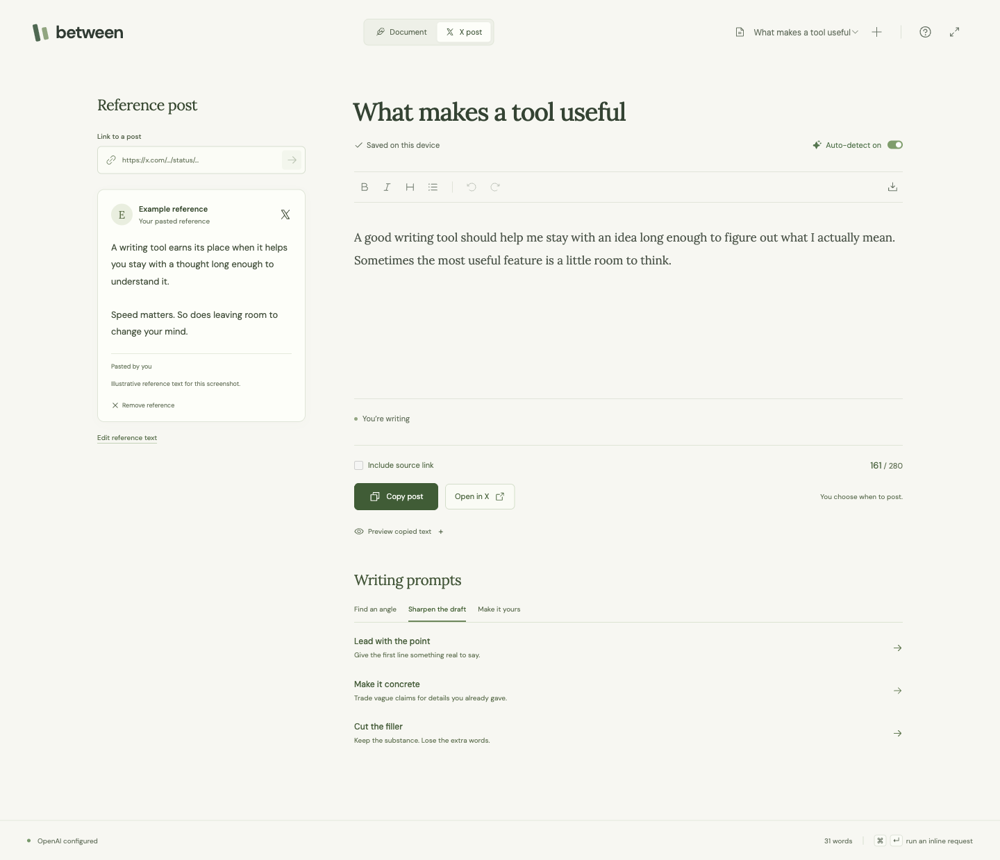

<p align="center"></p>

Between keeps the post that sparked a thought beside your draft. Write your response, ask for an edit right on the page, and copy the result into X when it feels like you.

The writing-or-prompting interaction is inspired by **[Kasper Marx Andersen’s original demo](https://x.com/KaAnDK/status/2107754495132184653)**. His post was the starting point for this project; Between adds a local X writing workflow around that idea.

<p align="center"><a href="#get-started">Get started</a> · <a href="#writing-with-between">Writing with Between</a> · <a href="#privacy-and-control">Privacy</a> · <a href="CONTRIBUTING.md">Contributing</a></p>



*Screenshot uses illustrative writing, not someone’s private draft.*

## What it does

- **Keeps the original close.** Paste an X link and read the reference alongside your own words. Long references expand without clipping. If X withholds the full text, paste it yourself.
- **Understands an inline request.** Write “make this more concise” in the document. OpenAI detects the request; Enter turns it into an edit.
- **Offers useful editorial help.** Nine prompts help you find a takeaway, test a premise, sharpen an opening, preserve nuance, or fit one post.
- **Makes the handoff easy.** Weighted character counting, an optional source link, an exact copy preview, **Copy post**, and a prefilled **Open in X** composer. You choose when to publish.
- **Gives you room to change your mind.** Local autosave, separate drafts, focus mode, Markdown export, and one-step Undo for AI edits. Document mode supports longer writing and rich text.

## Get started

You need **Node.js 24+** and an **OpenAI API key** with access to the models you choose. AI usage is billed to your OpenAI API account; a ChatGPT subscription does not include API credits. Writing, reference lookup, and copying also work without a key.

```sh
git clone https://github.com/patrickmuggill/between.git
cd between
npm ci
npm run setup
npm run build
npm start
```

Open **[127.0.0.1:4173](http://127.0.0.1:4173)**.

Setup asks for your key without displaying it and saves it to the ignored `.env.local`. It asks before replacing an existing configuration. The key stays on the local server and never enters the browser bundle.

Prefer to configure it yourself? Copy [.env.example](.env.example) to `.env.local`, fill in `OPENAI_API_KEY`, and restart the server. You can also supply the key as an environment variable. Never use a `VITE_` variable for a secret.

For development, use `npm run dev` instead of the build/start steps.

## Writing with Between

1. Paste a post link in **Reference post**, or paste its text. You can also write an original post with no reference.
2. Write your own take. A paragraph identified as a request turns green; press **Enter** to run it. Editorial prompts can also apply an edit directly.
3. Review the result. **Undo** restores the previous version. Identified inline instructions stay out of copied text; **Treat as writing** reverses a false positive.
4. Check **Preview copied text**, choose whether to include the source link, then **Copy post** or **Open in X**.

| Shortcut | Action |
| --- | --- |
| Enter on an identified request | Run the request |
| ⌘/Ctrl + Enter | Explicitly run the current paragraph |
| Shift + Enter | Insert a line break |
| Escape | Stop generation and keep the original draft |
| ⌘/Ctrl + Z | Undo |

The counter follows standard X weighting: links count as 23 characters, and emoji and most CJK characters count as two. A longer draft stays editable and copyable. The app does not split or publish threads automatically.

## Privacy and control

- Drafts and reference text save in **this browser’s local storage**. There is no account, analytics service, or server-side draft database. Use the same local URL each time; clearing browser storage removes drafts. Export anything you want to keep elsewhere.
- With **Auto-detect on**, the current paragraph, surrounding draft, and attached reference go to OpenAI after a short pause. Turn it off to send text only when you explicitly request help. Both modes use your own API key.
- Generation uses the Responses API with `store: false`. This is not a promise of zero retention; [OpenAI’s API data controls](https://developers.openai.com/api/docs/guides/your-data) still apply.
- Loading an X reference contacts X. The server extracts text without executing X’s scripts or forwarding your browser cookies. Quotes, media, unavailable posts, or changes to X’s public pages may require opening the original or pasting the full text.
- The server binds only to **127.0.0.1**. It is designed for one person on their own computer. Do not put it behind a public tunnel or treat it as a hosted multi-user service.

See [SECURITY.md](SECURITY.md) for the trust boundaries and protections.

## Configuration

| Variable | Default | Purpose |
| --- | --- | --- |
| `OPENAI_API_KEY` | unset | Enables AI assistance |
| `OPENAI_DECISION_MODEL` | `gpt-6-luna` | Model supported by the Decisions API |
| `OPENAI_GENERATION_MODEL` | `gpt-6-luna` | Model supported by the Responses API |
| `PORT` | `4173` | Local server port |

The two model settings are independent. Your account must have access to the corresponding model and API. No simulated AI fallback is used.

<details>
<summary>Troubleshooting</summary>

- **No key configured:** run `npm run setup`, restart Between, then use **OpenAI settings → Check connection**. That check confirms configuration; the first AI request verifies access.
- **API credits or quota error:** check the selected project’s [API billing](https://platform.openai.com/settings/organization/billing/overview). A replacement key does not fix a quota-only issue.
- **Model/access error:** choose models your account can use in `.env.local`. Ordinary writing and copying remain available.
- **Incomplete reference:** use **Paste complete text** or **Edit reference text**. Up to 60,000 UTF-16 units are accepted—enough for a 25,000-character post even with surrogate-pair emoji. Oversized input is rejected explicitly, never silently cut.
- **Clipboard blocked:** the copy dialog selects the exact post text for manual copying.
- **Port already in use:** set `PORT=4174` in `.env.local`, restart, and use the new URL. Browser drafts are specific to their original URL and port.

</details>

## Under the hood

React, TypeScript, and Tiptap provide the editor. A small Express server keeps credentials out of the browser. The [OpenAI Decisions API](https://developers.openai.com/api/docs/guides/decisions) classifies intent; the [Responses API](https://developers.openai.com/api/docs/guides/text) streams edits. X reference text is passed separately from the author’s draft and treated as untrusted context.

Document context is prepared after the typing pause. Document-only Markdown processing loads on demand. Fonts ship locally, and production assets are split for caching.

```sh
npm test                 # Unit, security, setup, and server checks
npm run build
npx playwright install chromium
npm run test:browser     # Isolated production browser checks; no real API calls
npm run check:release    # Check release files for secrets and local-only paths
npm run preview:readme   # Preview this README locally
```

The browser runner starts its own temporary server and browser contexts. It does not use your API key or change an open writing session. The CI workflow runs the same checks; it needs no secrets.

## Credits and license

Created by [Patrick Muggill](https://github.com/patrickmuggill). The core interaction is inspired by [Kasper Marx Andersen’s post and demo](https://x.com/KaAnDK/status/2107754495132184653), with credit and thanks for the idea.

[MIT](LICENSE). Open-source dependencies retain their own licenses; see [THIRD_PARTY_NOTICES.md](THIRD_PARTY_NOTICES.md).
